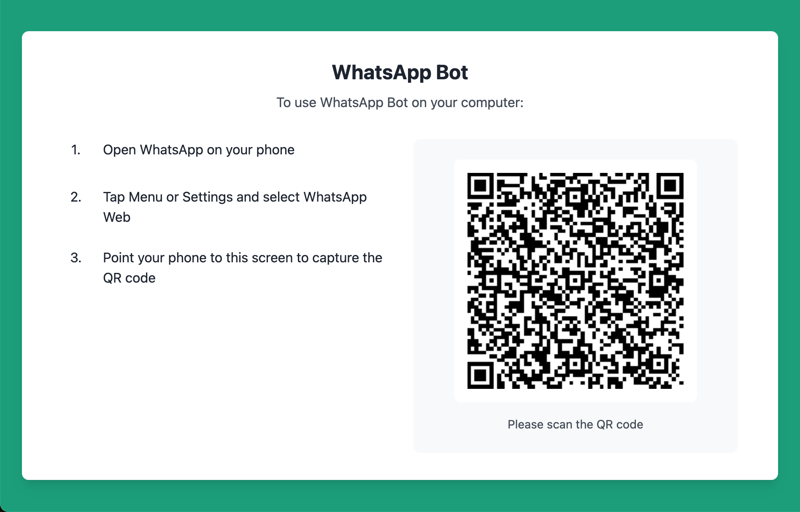
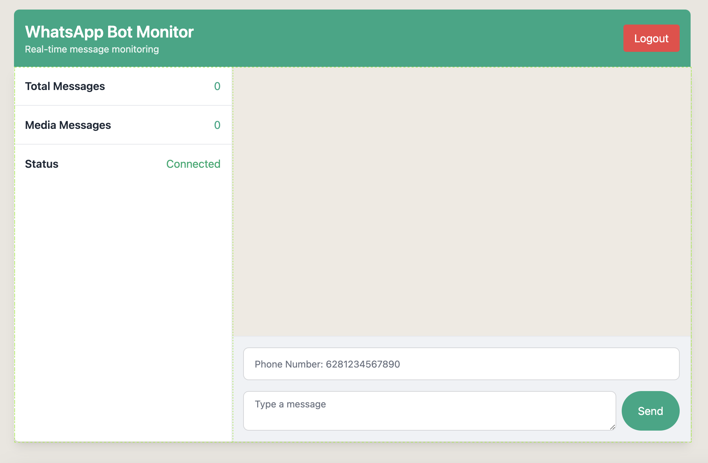

# WhatsApp Bot Monitor

A real-time WhatsApp message monitoring dashboard built with modern web technologies. This project demonstrates proficiency in building responsive web applications with real-time capabilities.

## 🚀 Features

- **Real-time Message Monitoring**: Live updates of incoming WhatsApp messages
- **Message Statistics**: Track total and media message counts
- **Responsive Design**: Mobile-friendly WhatsApp-like interface
- **Message Management**: Send messages directly from the dashboard
- **Clean UI**: Modern, intuitive interface with WhatsApp-inspired design

## 💻 Technologies Used

- **Frontend**:
  - HTML5
  - Tailwind CSS for styling
  - JavaScript (Vanilla) for interactivity
  - WebSocket for real-time updates

- **Backend**:
  - Node.js
  - Express.js
  - WhatsApp Web.js
  - WebSocket Server

- **UI Components**:
  - DaisyUI for enhanced UI components
  - Custom WhatsApp-like design system

## 🎯 Technical Highlights

- **Responsive Layout**: Fluid design that adapts to different screen sizes
- **Real-time Updates**: WebSocket implementation for instant message updates
- **Efficient Message Handling**: Smart message queue system with a 100-message display limit
- **Security**: HTML escaping for safe message rendering
- **Modern CSS**: Utilization of Tailwind CSS for maintainable styling

## 🛠️ Getting Started

1. Clone the repository
2. Install dependencies:
   ```bash
   npm install
   ```
3. Build the CSS:
   ```bash
   npm run build
   ```
4. Start the development server:
   ```bash
   npm run dev
   ```

## 🔧 Environment Setup

Create a `.env` file in the root directory with the following variables:
```
env
PORT=3000
NODE_ENV=development
```

## 🎨 Design Philosophy

The project follows WhatsApp's design language while maintaining its own identity:
- Clean, minimalist interface
- Intuitive message layout
- Responsive design principles
- Accessibility considerations

## 💡 Skills Demonstrated

- **Frontend Development**
  - Modern HTML5 & CSS3
  - JavaScript ES6+
  - Real-time data handling
  - Responsive design implementation

- **UI/UX Design**
  - Component-based design
  - User-friendly interface
  - WhatsApp-inspired patterns

- **Best Practices**
  - Clean code principles
  - Performance optimization
  - Security considerations
  - Modern web development patterns

## 📸 Screenshots




## 📝 License

MIT License - feel free to use this project for learning and development purposes.

---